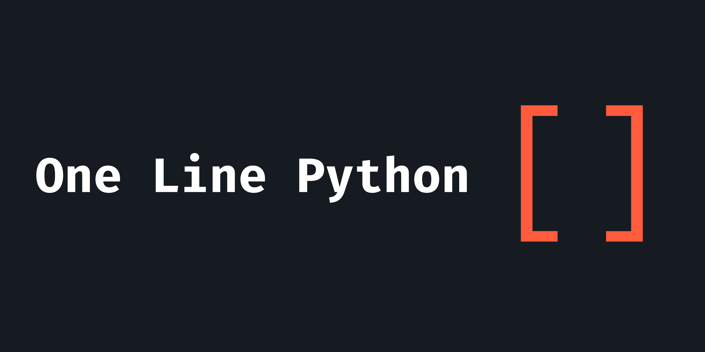

---

<a href="./index.md"></a>

Esqueça o uso de várias linhas no seu código. Condense tudo e faça tudo em apenas uma linha. Arrays são seus aliados, permitindo que você execute todas as tarefas que costumava fazer antes, agora em apenas uma única linha.

# Introdução
Bem-vindo ao repositório One Line Python! Aqui, exploramos a arte de escrever código Python conciso desafiando-nos a realizar tarefas em apenas uma linha de código. Este repositório tem como objetivo mostrar soluções criativas e eficientes para vários problemas de programação, tudo condensado em uma única linha.

# Sumário

- [Introdução](#introdução)
- [Sumário](#sumário)
- [Regras](#regras)
- [Conceitos de Código](#conceitos-de-código)
  - [Variáveis](#variáveis)
    - [Usando o tipo de dado `list`](#usando-o-tipo-de-dado-list)
      - [Modificando o valor](#modificando-o-valor)
    - [Usando o tipo de dado `dict`](#usando-o-tipo-de-dado-dict)
      - [Modificando o valor](#modificando-o-valor-1)
    - [Modificando variáveis globais](#modificando-variáveis-globais)
      - [Modificando o valor](#modificando-o-valor-2)
  - [Condições](#condições)
    - [Sequência de instruções `if`](#sequência-de-instruções-if)
  - [Funções](#funções)
  - [Módulos](#módulos)
  - [Loop While](#loop-while)
  - [Classes](#classes)
- [Contribuindo](#contribuindo)
- [Licença](#licença)

# Regras

1. Todo o código deve ser escrito em apenas uma linha, incluindo quaisquer arquivos importados (com exceções para módulos/bibliotecas padrão e externos).
2. Não use `;` como separador de linhas.
3. Não use `exec()`.

Abaixo, você encontrará diferentes conceitos aplicados em formato de uma linha. Tenha em mente que essas soluções nem sempre serão as mais eficientes ou adequadas para todos os cenários. Elas são soluções específicas encontradas para casos particulares.

# Conceitos de Código

## Variáveis

Encontrei algumas soluções para definir e modificar variáveis:

### Usando o tipo de dado `list`

Recomendado quando você só precisa usar uma única variável.

**Sintaxe**
```py
[... for variável in [valor]]
```

Você pode tentar adicionar mais valores, mas geralmente não é recomendado.

#### Modificando o valor

A solução que encontrei para modificar o valor da variável é não convencional, mas funcional:

**Sintaxe**
```py
[variável.replace(variável, novo_valor) for variável in [valor]]
```

### Usando o tipo de dado `dict`

Ótimo quando você precisa usar várias variáveis.

**Sintaxe**
```py
[... for variáveis in [{'variável_A': 'valor', 'variável_B': 'valor', ...}]]
```

#### Modificando o valor

Use o método `.update` para alterar os valores das variáveis.

**Sintaxe**
```py
[variáveis.update({'variável_A': 'novo valor'}) for variáveis in [{'variável_A': 'valor', 'variável_B': 'valor', ...}]]
```

### Modificando variáveis globais

Semelhante ao método anterior, podemos atualizar variáveis globais para adicionar nossas próprias variáveis. Esse método é mais interessante, pois nos permite usar a variável como se fosse definida convencionalmente.

**Sintaxe**
```py
[globals().update({'variável':'valor'})]
```

#### Modificando o valor

Como não podemos usar `=` para alterar o valor da variável, podemos usar o mesmo método apresentado para modificar variáveis do tipo `dict`.

**Sintaxe**
```py
[globals().update({'variável':'novo_valor'})]
```

## Condições

Esse tópico pode ser ignorado se você já está acostumado a usar declarações `if-else` dentro de arrays, pois não há mudanças significativas na implementação.

Uma declaração `if` isolada, sem a necessidade de um `else`, pode ser adicionada após a declaração `for`:

**Sintaxe**
```py
[for variável in [valor] if condição]
```

Se um `else` for necessário, você pode adicionar a condição antes da declaração `for`:

**Sintaxe**
```py
[... if condição else ... for variável in [valor]]
```

Se um `elif` for necessário, você pode adicionar declarações `if` adicionais dentro da seção `else`:

**Sintaxe**
```py
[... if condição else (... if condição else ...) for variável in [valor]]
```

> Os parênteses são opcionais; eles foram adicionados para melhor visualização.

### Sequência de instruções `if`

Existem vários cenários com propósitos diferentes. Em um cenário em que você precisa de uma sequência de instruções `if` que retornam valores diferentes sem usar `else`, você pode representar a condição `else` como `None`:

**Sintaxe**
```py
[[... if condição else None, ... if condição else None] for variável in [valor]]
```

O problema de usar essa abordagem é que os valores `None` estão presentes no array. Se isso for problemático, você pode usar `filter` com `list` para remover esses valores `None`:

**Sintaxe**
```py
[list(filter(lambda resultado_condição: resultado_condição != None, [... if condição else None, ... if condição else None])) for variável in [valor]]
```

**Exemplo**

```py
[list(filter(lambda resultado_condição: resultado_condição != None, ['Maior que 10' if número > 10 else None, 'Maior que 20' if número > 20 else None])) for número in [11]]
```

**Equivalente a**
```py
número = 40
if número > 10: print('Maior que 10')
if número > 20: print('Maior que 20')
```

## Funções

A solução para funções de uma linha é usar `lambda`. Não é necessário usar `return`.

 Todos os métodos para definir variáveis podem ser aplicados aqui.

**Sintaxe** *(lista)*
```py
[função() for função in [lambda parâmetro: ...]]
```
**Sintaxe** *(dict)*
```py
[variáveis['função']() for variáveis in [{'função': lambda parâmetro: ...}]]
```
**Sintaxe** *(global)*
```py
[globals().update({'função': lambda parâmetro: ...})]
```

**Exemplo**

```py
[[ímpar(número) for número in [2,11,5]] for ímpar in [lambda número: "É par" if número % 2 == 0 else "É ímpar"]]
```

**Equivalente a**
```py
def ímpar(número):
    if número % 2 == 0: return "É par"
    return "É ímpar"

ímpar(2) # É par
ímpar(11) # É ímpar
ímpar(5) # É ímpar
```

## Módulos

Para importar módulos, podemos usar os mesmos conceitos para definir e usar a função `__import__`. Dessa forma, podemos importar o módulo inteiro:

**Sintaxe**
```py
[... for módulo in [__import__('nome_do_módulo')]]
```

**Exemplo**

```py
[os.listdir('./') for os in [__import__('os')]]
```

**Equivalente a**

```py
import os
os.listdir('./')
```

## Loop While

Para criar um loop `while`, precisamos usar recursão:

**Sintaxe**
```py
[while_loop(while_loop) for while_loop in [lambda ciclo: [..., ciclo(ciclo) if condição else None][1]]]
```

**Exemplo**

```py
[globals().update({'i':0}), [while_loop(while_loop) for while_loop in [lambda ciclo: [[print(i), globals().update({'i':i+1})], ciclo(ciclo) if i <= 5 else None][1]]]]
```

**Equivalente a**

```py
i = 0
while i <= 5:
    print(i)
    i += 1
```

Aqui está outro exemplo:

**Exemplo**

```py
[[while_loop(while_loop) for while_loop in [lambda ciclo: [[print(ímpar(número)) for número in [int(input('Número: '))]], ciclo(ciclo)][1]]] for ímpar in [lambda número: "É ímpar" if número % 2 == 0 else "É par"]]
```

**Equivalente a**
```py
def ímpar(número):
    if número % 2 == 0: return "É par"
    return "É ímpar"

while True:
    número = int(input("Número: "))
    print(ímpar(número))
```

## Classes

A abordagem que pensei para criar uma `class` é usar `lambda` e `SimpleNamespace`:

**Sintaxe**
```py
[globals().update({'SimpleNamespace': __import__('types').SimpleNamespace}), globals().update({'nome_da_classe': lambda parâmetros: [<código_de_inicialização>, SimpleNamespace(**{'método': lambda parâmetros: ...})][1]})]
```

**Exemplo**
```py
[globals().update({'SimpleNamespace': __import__('types').SimpleNamespace}), globals().update({'Cachorro': lambda nome: [globals().update({'nome':nome}), SimpleNamespace(**{'latir': lambda: print(f'{nome} está latindo!')})][1]})]
```

**Equivalente a**
```py
from types import SimpleNamespace

class Cachorro:
    def __init__(self, nome):
        self.nome = nome
    
    def latir(self):
        print(f'{self.nome} está latindo!')

c1 = Cachorro('Rex')
c1.latir() # Rex está latindo!
```

# Contribuindo

Sinta-se à vontade para contribuir com soluções criativas e eficientes para resolver problemas em apenas uma linha de código Python. Você pode fazer um fork deste repositório, adicionar suas próprias soluções e enviar uma solicitação pull.

Certifique-se de seguir as regras estabelecidas e fornecer exemplos e explicações adequadas para suas soluções.

# Licença

Este projeto está licenciado sob a licença MIT. Consulte o arquivo [LICENSE](LICENSE) para obter mais informações.